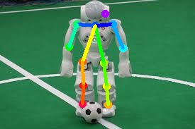

<div align="center">
    
</div>

|                  |`Default Config`  |`CUDA (+Python)`  |`CPU (+Python)`   |`OpenCL (+Python)`| `Debug`          | `Unity`          |
| :---:            | :---:            | :---:            | :---:            | :---:            | :---:            | :---:            |
| **`Linux`**   | [](https://travis-ci.org/CMU-Perceptual-Computing-Lab/openpose) | [](https://travis-ci.org/CMU-Perceptual-Computing-Lab/openpose) | [](https://travis-ci.org/CMU-Perceptual-Computing-Lab/openpose) | [](https://travis-ci.org/CMU-Perceptual-Computing-Lab/openpose) | [](https://travis-ci.org/CMU-Perceptual-Computing-Lab/openpose) | [](https://travis-ci.org/CMU-Perceptual-Computing-Lab/openpose) |
| **`MacOS`**   | [](https://travis-ci.org/CMU-Perceptual-Computing-Lab/openpose) | | [](https://travis-ci.org/CMU-Perceptual-Computing-Lab/openpose) | [](https://travis-ci.org/CMU-Perceptual-Computing-Lab/openpose) | [](https://travis-ci.org/CMU-Perceptual-Computing-Lab/openpose) | [](https://travis-ci.org/CMU-Perceptual-Computing-Lab/openpose) | [](https://travis-ci.org/CMU-Perceptual-Computing-Lab/openpose) |

# On-Field-Gesture-based-Robot-to-robot-Communication-with-NAO-Soccer-Players
Non-verbal communication is often used by soccer players during matches to exchange information with teammates. Among the possible forms of gesture-based interaction, hand signals are the most used. In this paper, we present a deep learning method for real-time recognition of robot to robot hand signals exchanged during a soccer game. A library for estimating body, face, hands, and foot position has been trained using simulated data and tested on real images.  Quantitative experiments carried out on a NAO V6 robot demonstrate the effectiveness of the proposed approach. Source code and data used in this work are made publicly available for the community.



# TF-Pose

'Openpose', human pose estimation algorithm, have been implemented using Tensorflow. It also provides several variants that have some changes to the network structure for real-time processing on the CPU or low-power embedded devices.

## Installation
To install the code you have to download the TF-Pose or Open-Pose library at this link :
- https://github.com/ildoonet/tf-pose-estimation
- https://github.com/CMU-Perceptual-Computing-Lab/openpose

### Dependencies

You need dependencies below.

- python3
- tensorflow 1.4.1+
- opencv3, protobuf, python3-tk
- slidingwindow

### Install

Clone the repo and install 3rd-party libraries.

```bash
$ git clone https://www.github.com/ildoonet/tf-pose-estimation
$ cd tf-pose-estimation
$ pip3 install -r requirements.txt
```

Build c++ library for post processing. See : https://github.com/ildoonet/tf-pose-estimation/tree/master/tf_pose/pafprocess
```
$ cd tf_pose/pafprocess
$ swig -python -c++ pafprocess.i && python3 setup.py build_ext --inplace
```

### Package Install

Alternatively, you can install this repo as a shared package using pip.

```bash
$ git clone https://www.github.com/ildoonet/tf-pose-estimation
$ cd tf-openpose
$ python setup.py install  # Or, `pip install -e .`
```
### Download Tensorflow Graph File(pb file)

Before running demo, you should download graph files. You can deploy this graph on your mobile or other platforms.

- cmu (trained in 656x368)
- mobilenet_thin (trained in 432x368)
- mobilenet_v2_large (trained in 432x368)
- mobilenet_v2_small (trained in 432x368)

```
$ cd models/graph/cmu
$ bash download.sh
```
## Demo

### Test Inference

You can test the inference feature with a single image.

```
$ python TF-Pose_NAO.py  --image=./PathToImage/image.jpg
```

The image flag MUST be relative to the src folder with no "~", i.e:
```
--image ../../Desktop
```

Then you will see the screen as below with pafmap, heatmap and result.


## References

### OpenPose

[1] https://github.com/CMU-Perceptual-Computing-Lab/openpose

[2] Training Codes : https://github.com/ZheC/Realtime_Multi-Person_Pose_Estimation

[3] Custom Caffe by Openpose : https://github.com/CMU-Perceptual-Computing-Lab/caffe_train

[4] Keras Openpose : https://github.com/michalfaber/keras_Realtime_Multi-Person_Pose_Estimation

[5] Keras Openpose2 : https://github.com/kevinlin311tw/keras-openpose-reproduce

### tf-pose-estimation

[1] https://github.com/ildoonet/tf-pose-estimation

### Tensorflow Tips

[1] Freeze graph : https://github.com/tensorflow/tensorflow/blob/master/tensorflow/python/tools/freeze_graph.py

[2] Optimize graph : https://codelabs.developers.google.com/codelabs/tensorflow-for-poets-2

[3] Calculate FLOPs : https://stackoverflow.com/questions/45085938/tensorflow-is-there-a-way-to-measure-flops-for-a-model


